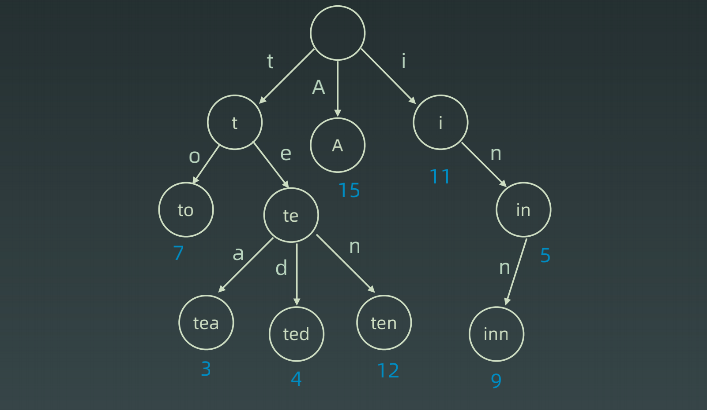
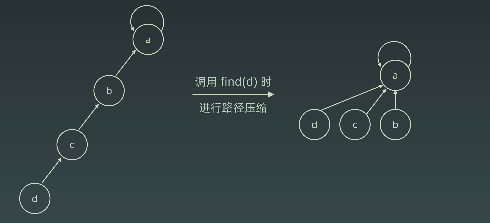
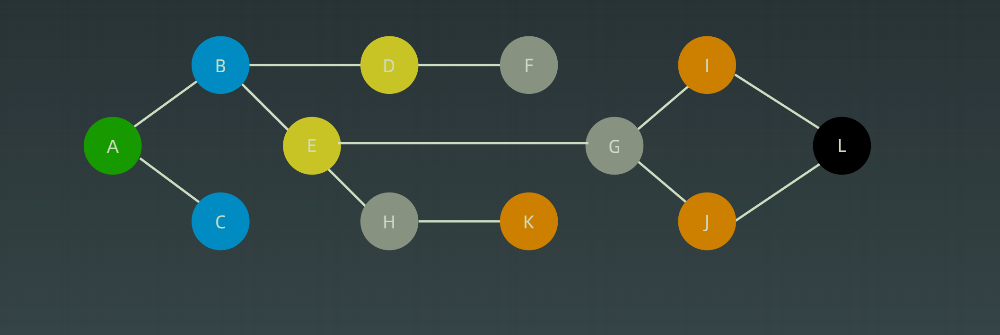
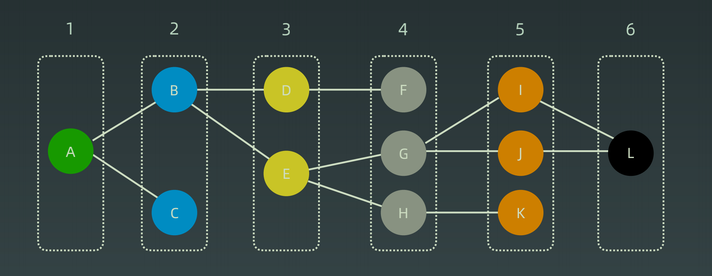

### Trie

1. 结点本身不存完整的单词
2. 从根节点到某一节点 路径上经过的字符连接起来 为该节点对应的字符串
3. 每个节点子节点路径代表的字符都不相同
4. <font color="red">实际上思想就是以空间换时间、利用字符串公共前缀减少查询时间的开销</font>

#### 基本结构

​	**大幅度减少无谓的比较** 并且每层只比较一个字符 查询效率极高


#### 应用

​	想要通过前缀找出所有联想的词语 只需要输出当成节点的所有子节点(可能性)即可


#### 内部实现


#### 扩展

​	节点本身不仅仅可以存储字符 还可以存储一些额外信息 例如频次



#### Java实现

```java
// 只有小写字母的Java代码模板
class Trie {
    Trie[] next;
    private final int R = 26;
    boolean isEnd = false;
    
    
    public void insert(String word) {
        Trie cur = this;
        for (char c : word.toCharArray()) {
            if (cur.next[c - 'a'] == null) {
				cur.next[c - 'a'] = new Trie();
            }
            cur = cur.next[c - 'a'];
        }
        cur.isEnd = true;
    }
    
    public boolean search(String word) {
        Trie cur = this;
        for (char c : word.toCharArray()) {
            if (cur.next[c - 'a'] == null) return false;
            cur = cur.next[c - 'a'];
        }
		return cur.isEnd;
    }
    
    public boolean startsWith(String prefix) {
        Trie cur = this;
        for (char c : prefix.toCharArray()) {
            if (cur.next[c - 'a'] == null) return false;
            cur = cur.next[c - 'a'];
        }
		return true;
    }
}
```

### Disjoint Set / UnionFind

#### 应用

​	组团、配对问题、Group or not?

#### 基本操作

- makeSet(s)：建立一个新的并查集，其中包含 s 个单元素集合。 - 初始化
- unionSet(x, y)：把元素 x 和元素 y 所在的集合合并，要求 x 和 y 所在的集合不相交，如果相交则不合并。
- find(x)：找到元素 x 所在的集合的代表，该操作也可以用于判断两个元素是否位于同一个集合，只要将它们各自的代表比较一下就可以了。

#### 看图学习


#### 优化

​	可以进行路径压缩(子节点直接指向父节点 时间复杂度压缩到O(1))



#### Java实现

```java
class UnionFind {
    private int count = 0;
    private int[] parent;

    public UnionFind(int n) {
        this.count = n;
        parent = new int[n];
        for (int i = 0; i < n; i++) {
            parent[i] = i;
        }
    }

    public int find(int p) {
        int x = p;
        // 查找
        while (parent[p] != p) {
            // 小路径压缩 直接指向爷爷节点
            parent[p] = parent[parent[p]];
            p = parent[p];
        }
        // 路径压缩
        while (x != p) {
            int pre = parent[x];
            parent[x] = p;
            x = pre;
        }
        return p;
    }

    public void union(int p, int q) {
        int rootP = find(p);
        int rootQ = find(q);
        if (rootP == rootQ) return;
        parent[rootP] = rootQ;
        count --;

    }
}
```

### 高级搜索

1. 朴素搜索
2. 优化方式: 不重复(fifibonacci)- 不进行重复计算、剪枝(生成括号问题)-  根据条件 在搜索时去除不符合条件的延伸
3. 搜索方向： 
    1. DFS: depth fifirst search 深度优先搜索
    2. BFS: breadth fifirst search 广度优先搜索 
    3. 双向搜索、启发式搜索

#### Coin change 状态树


#### BFS/DFS Code

```java
// DFS代码模板
public void dfs(TreeNode root) {
    if (root == null) return;
    Stack<TreeNode> stack = new Stack<>();
    stack.push(root);
    while (!stack.isEmpty()) {
        TreeNode cur = stack.pop();
        // visited
        // process
        // generate result
        // sub stack push
    }
}

// BFS
public void bfs(TreeNode root) {
    if (root == null) return;
    Queue<TreeNode> queue = new LinkedList<>();
    queue.offer(root);
    while (!queue.isEmpty()) {
        TreeNode cur = queue.poll();
        // visited
        // process
        // generate result
        // sub queue.push
    }
}
```

#### 剪枝

​	在当层中, 根据条件 **将不符合条件的延伸去除** 以免进行不必要的计算

#### 双向BFS






#### 启发式搜索(A*)

​	在普通搜索(BFS)的基础上 增加优先级计算 而不是普通原本的傻搜、也就是估价函数

##### 估价函数

启发式函数： h(n)，它用来**评价哪些结点最有希望的是一个我们要找的结点**，h(n) 会返回一个非负实数,也可以认为是从结点n的目标结点路径的估计成本。

启发式函数是一种**告知搜索方向**的方法。它提供了一种明智的方法来猜测**哪个邻居结点会导向一个目标**。

### 高级树

#### 前言

> 1. 二叉搜索树 左子树所有节点均小于根节点 右子树所有节点均大于根节点 以此类推 左右子树也是二叉搜索树
> 2. 如果使用中序遍历 那么是一个有序的
> 3. 查询和插入都是O(logN) 因为每次只用选择左右的其中一边
>
> 在极端情况下 二叉搜索树有可能偏向一边倒 也就是变成一根棍子的树 这个时候就相同于退化成链表 时间复杂度退化为O(n)

#### AVL

> 为了弥补普通二叉搜索树的缺点, 出现了平衡二叉搜索树. AVL是其中的一种.
>
> 1. 平衡因子的由来是二叉搜索树的时间复杂度为树的深度
> 2. 每个节点都存储一个平衡因子 factor{-1, 0, 1} - 也就是左右子树的高度差小于绝对值1
> 3. 如果不满足平衡因子条件 则需要进行调整
>     1. 左旋
>     2. 右旋
>     3. 左右旋
>     4. 右左旋
>
> **缺点**
>
> 1. 由于AVL是完全平衡二叉搜索树 所以每次1.2个节点变动的话 可能就需要进行调整 调整次数过多
> 2. 每个节点需要存储factor和height 也就是int类型的值 内存占用变大

#### Red black Tree

> 为了弥补AVL完全平衡二叉搜索树的缺点 就出现了近似平衡二叉搜索树 红黑🌲只是其中的一种
>
> **左右子树高度差小于两倍**
>
> 1. 节点的红色和黑色
> 2. 根节点是黑色节点
> 3. 叶子节点(NIL、空节点)是黑色节点
> 4. 两个红色节点不能邻接
> 5. 从任一节点到每个叶子节点的所有路径都包含相同的黑色节点个数
>
> 近似平衡二叉搜索树还是能很好的做到O(logN)的时间复杂度 并且对平衡调整有一个折中的次数

#### 两者对比

> 1. **AVL** 查询性能更优 因为是严格平衡二叉搜索树
> 2. **Red Black Tree** 插入和删除性能更优 因为调整次数相对较少
> 3. **AVL** 占用的内存空间更多 因为每个节点需要存储factor和height信息 
> 4. **Red Black Tree** 只需要存储 0/1 也就是黑色或者红色
>
> **如果读更多的话使用AVL、写更多的话使用Red Black Tree, 两者参半的话使用红黑树(实现相对简单)**

### 作业

#### 单词搜索 II - 复杂度分析

> 以下面这个代码为分析
>
> 1. Trie时间复杂度为O(n)
> 2. 遍历字母二维网格 时间复杂度为O(n^2)
> 3. DFS延伸复杂度
>     1. 四连通 每次四个方向
>     2. 然后第一次延伸出去之后 每次再延伸三个反向(不能选取重复字母 不会往回) - 由于是第二次延伸开始 所以需要延伸的长度是 单词长度- 1
>     3. 然后延伸的层数是单词长度  Length -> L
>     4. 总结 4 * 3 ^ (L - 1)  => 4^L
>
> 总结 - O(n^3 - 4^L)

```java
class Solution {
    class Trie {
        Trie[] next;
        String word;
        boolean isEnd = false;

        public Trie() {
            this.next = new Trie[26];
        }

        public void insert(String word) {
            Trie cur = this;
            for (char c : word.toCharArray()) {
                if (cur.next[c - 'a'] == null) {
                    cur.next[c - 'a'] = new Trie();
                }
                cur = cur.next[c - 'a'];
            }
            cur.word = word;
            cur.setEnd();
        }

        public boolean search(String word) {
            Trie cur = this;
            for (char c : word.toCharArray()) {
                if (cur.next[c - 'a'] == null) return false;
                cur = cur.next[c - 'a'];
            }
            return cur.isEnd();
        }

        public boolean startsWith(String prefix) {
            Trie cur = this;
            for (char c : prefix.toCharArray()) {
                if (cur.next[c - 'a'] == null) return false;
                cur = cur.next[c - 'a'];
            }
            return true;
        }

    }
    int[][] direction = new int[][]{
            {0, -1},
            {-1, 0},
            {0, 1},
            {1, 0}
    };
    public List<String> findWords(char[][] board, String[] words) {
        List<String> res = new ArrayList<>();
        Trie root = new Trie();
        for (String word : words) {
            root.insert(word);            
        }
        int m = board.length;
            int n = board[0].length;
            for (int i = 0; i < m; i++) {
                for (int j = 0; j < n; j++) {
                    if (root.next[board[i][j] - 'a'] != null) {
                        dfs(i, j, root, board, res);
                    }
                }
            }
            return res;
    }
    
    private void dfs(int i, int j, Trie root, char[][] board, List<String> res) {
        // terminator
        char c = board[i][j];
        Trie cur = root.next[c - 'a'];
        if (cur == null) return;
        if (cur.word != null) {
            res.add(cur.word);
            cur.word = null;
        }
        // process
        board[i][j] = '#';
        for (int[] ints : direction) {
            int x = i + ints[0];
            int y = j + ints[1];
            if (x < 0 || x >= board.length || y < 0 || y >= board[0].length || board[x][y] == '#') continue;
            // drill down
            dfs(x, y, cur, board, res);
        }
        // reverse states
        board[i][j] = c;
    }
}
```

#### 双向BFS代码模板

```java
public void doubleBFS(String begin, String end, Set<String> list) {
   	// corner
    if (!list.contains(end)) return;
    // init
    Set<String> beginSet = new HashSet<>();
    Set<String> endSet = new HashSet<>();
    Set<String> visited = new HashSet<>();
    beginSet.add(begin);
    endSet.add(end);
    
    while (!beginSet.isEmpty() && !endSet.isEmpty()) {
        // Less choose
        if (beginSet.size() > endSet.size()) {
            Set<String> temp = beginSet;
            beginSet = endSet;
            endSet = temp;
        }
		       
        // process
    	    // visited
	        // push
        // generate final result
    }
    // return result
}
```


