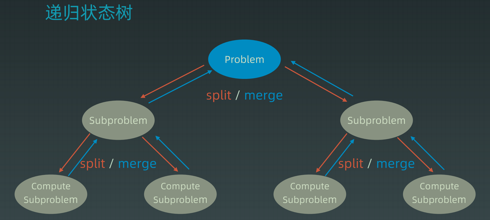
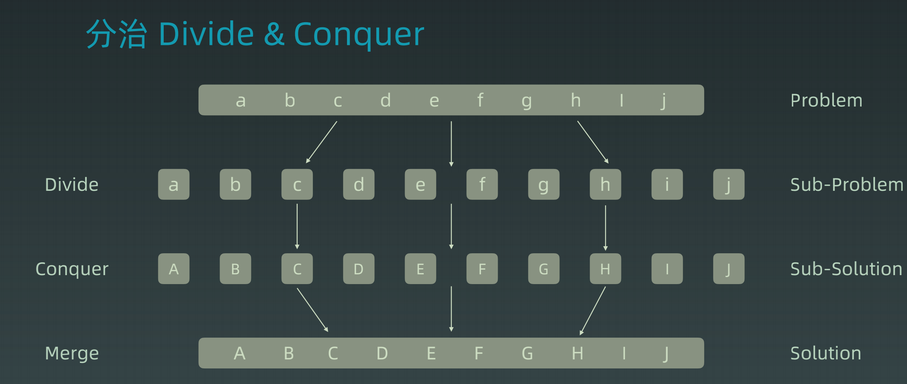

### 泛型递归

#### 前情回顾

**为什么树的解法一般都是递归?**

	1. 节点的定义
 	2. 重复性(自相似性)

```java
class TreeNode {
    int val;
    TreeNode left;
    TreeNode right;
    
    public TreeNode(int val) {
        this.val = val;
        this.left = null;
        this.right = null;
    }
}
List<TreeNode> res = new ArrayList<>();
// 前序 - 根左右
public void preorder(TreeNode root) {
    res.add(root.val);
    preorder(root.left);
    preorder(root.right);
}
// 中序 - 左根右
public void inorder(TreeNode root) {
    inorder(root.left);
    res.add(root.val);
    inorder(root.right);
}
// 后序 - 左右根
public void postorder(TreeNode root) {
    postorder(root.left);
    postorder(root.right);
    res.add(root.val);
}
```

#### 递归

​	**递归 - 循环 也就是通过函数体来进行循环**

```java
// Java递归代码模板
public void recur(int level, int param) {
	// terminator
    if (level > MAX_LEVEL) {
        // process result
        return;
    }
    // process current logic
    process(level, param);
    // drill down
    return (level: level + 1, newParams);
    // restore current status
}
```

```python
# Python递归代码模板
def recursion(level, param1, param2, ...): 
	# recursion terminator 
	if level > MAX_LEVEL: 
 		process_result
		return
	# process logic in current level 
	process(level, data...) 
    # drill down 
    self.recursion(level + 1, p1, ...) 
	# reverse the current level status if needed
```

#### 思维要点

1. 不要人肉进行递归( 最大误区 )
2. 找到最近最简方法 将其拆解成可重复解决的问题(重复子问题)
3. 数组归纳法思维

### Divide & Conquer

​	**字面上的解释是分而治之 把一个复杂的问题分成两个或者更多的相同或相似的子问题 直到最后子问题可简单的直接求解 原问题的解即子问题的解合并 - 使用该技巧的排序(快速排序、归并排序)**





```java
private static int divide_conquer(Problem problem, ) {
  	// terminator
	if (problem == NULL) {
        int res = process_last_result();
        return res;     
    }
    // process current logic 
    subProblems = split_problem(problem);
	res0 = divide_conquer(subProblems[0]);
	res1 = divide_conquer(subProblems[1]);
    // merge 
	result = process_result(res0, res1);
	// restore states
    return result;
```

### Backtracking

​	**回溯法采用试错的思想 尝试分步的去解决一个问题 在分步解决问题的时候 通常尝试发现现有的分步答案不能得到有效的正确的解答时 将取消上一步或者上几步的计算 通过其他可能的分步解答再次尝试寻找问题的答案**

- 通常使用递归来实现
    - 找到一个可能存在的正确答案
    - 尝试了所有分步办法后宣告该问题没有答案
    - 最坏的情况下 回溯法会导致一次复杂度为指数级时间的计算