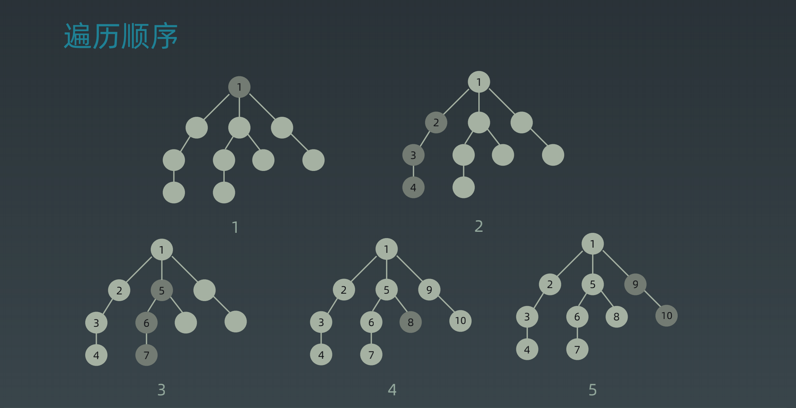
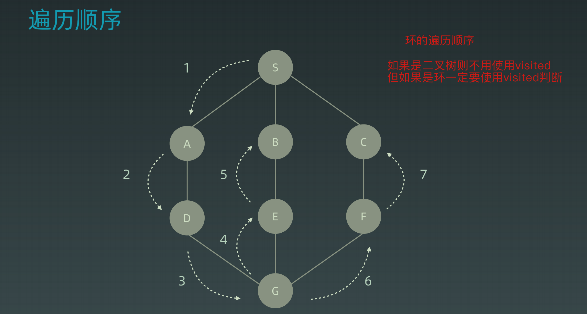
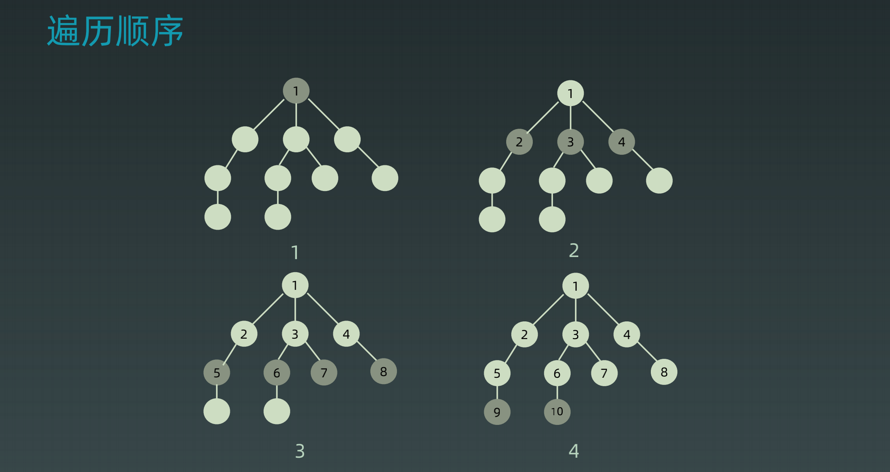
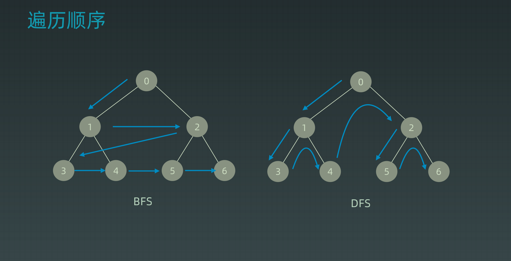

学习笔记

### 搜索

​	**在树(图/状态集)中寻找特定的节点**

```java
// 树的定义
class TreeNode {
    int val;
    TreeNode left;
    TreeNode right;
    public TreeNode(int val) {
        this.val = val;
        this.left = null;
        this.right = null;
    }
}
```

- 每个节点访问一次
- 每个节点**仅**访问一次
- 对于节点的访问顺序不限
    - 深度优先搜索
    - 广度优先搜索

#### Depth First Search

```java
// 代码模板 递归写法
public void dfs(TreeNode node) {
    if (!visited.contains(node)) return;
    
    visited.add(node);
    dfs(node.left);
    dfs(node.right);
}

// 非递归写法 相当于自己手动维护一个栈
public void dfs(TreeNode root) {
    if (root == null) return;
    Stack<TreeNode> stack = new Stack<>();
    
    stack.push(root);
    while (!stack.isEmpty()) {
        TreeNode cur = stack.pop();
        // terminator
        if (visited.contains(cur)) return;
        visited.add(cur);
        // process
        process(cur);
        // drill down
        stack.push(cur.left/right);
    }
}
```





#### Breadth First Search

```java
// 代码模板 - 手动维护一个队列 先进先出
public void bfs(TreeNode root)  {
    if (root == null) return;
    Queue<TreeNode> queue = new LinkedList<>();
    queue.offer(root);
    while (!queue.isEmpty()) {
        int levelSize = queue.size();
        while (levelSize-- > 0) {
            TreeNode cur = queue.poll();
            // terminator
            if (visited.contains(cur)) return;
            visited.add(cur);
            // process
        	process(cur);
            // drill down
            queue.offer(cur.left/right);
        }
    }
}
```



#### 顺序区别



### 贪心算法		

​	贪心算法是一种在每一步选择中都**采取在当前状态下最好或最优（即最有利）的选择**，从而**希望导致结果是全局最好或最优的算法**。 

#### 与动态规划的区别

​	贪心算法与动态规划的不同在于它对每个子问题的解决方案都做出选择，**不能回退**。动态规划则会**保存以前的运算结果**，并根据以前的结果对当前进行选择，有回退功能。

#### 缺陷

​	贪心法可以解决一些最优化问题，如：求**图中的最小生成树**、求**哈夫曼编码**等。然而对于工程和生活中的问题，贪心法一般不能得到我们所要求的答案。一旦可以使用贪心法来解决 那么贪心法一定是这个问题的最好解决办法。

​	由于贪心法的高效性以及其所求得的答案**比较接近最优结果**，贪心法也可以用作辅助算法或者直接解决一些**要求结果不特别精确的问题**。

#### 如何选择应用场景

​	简单地说，问题能够**分解成子问题来解决**，**子问题的最优解能递推到最终题的最优解**。这种子问题最优解称为**最优子结构。**

### 二分查找

1. 目标有单调性  递增、递减
2. 有上下界
3. 可以使用坐标、索引进行访问

```java
// 代码模板
int left = 0;
int right = nums.length - 1;
while (left <= right) {
    int mid = (left + right) / 2;
    if (nums[mid] > target) {
		right = mid - 1;
    } else if (nums[mid] < target) {
        left = mid + 1;
    } else {
        return mid;
    }
}
```

### 总结

#### DFS

​	深度优先搜索对于二叉树来讲 其实本质上有点相似于前序遍历 因为深度优先是选择一个点之后一直深入进行遍历 所以说其实算是栈的一个特性 先进后出 同层的节点进栈之后 处于栈底 于是就会先处理 子节点这个后进栈的节点.(可以自己维护一个栈或者使用系统栈(递归)进行实现)

#### BFS

​	广度优先搜索本质上算是一种层序遍历 跟深度优先相反 通过队列的特性进行实现 先进先出 同层的节点进队列之后 处于队列头 所以会先处理同层的节点.(由于系统调用无法实现队列的特性 所以只能自己手动维护一个队列)

#### 贪心算法

​	贪心算法的应用 问题能够拆分成很多子问题(当然大部分问题都是这样的) 然后从每个子问题选择最优解的时候 合并的时候能够得到最终问题的最优解 或者当实际需要的答案不是那么需要特别精确的答案时.
​	当然能够使用贪心算法的问题 使用的时候一定是非常简便、快捷的解决.

#### 二分查找	

​	二分查找 需要有硬性条件 有点类似与二叉搜索树的查找  能够将遍历的时间复杂度提升到O(logn), 两边向中间夹的一个过程 每次都能排除掉一半的可能性.

##### 二分查找，寻找一个半有序数组 [4, 5, 6, 7, 0, 1, 2] 中间无序的地方

主要是的思路就是弄清楚向前违规条件和向后违规条件 判断当前mid的索引 和 数组第一个索引进行比较
因为本身是个半有序的 所以中间无序的地方一定是 "左边一定是大于nums[0] 并且右边是小于nums[0]的"

```java
// 感觉应该是没有问题hhh 不过感觉自己写的不太好
// 如果助教有更好的代码请发给我学习学习~
int[] nums = new int[]{3, 0, 1, 2};
int left = 0;
int right = nums.length - 1;
while (left <= right)  {
    int mid = (left + right) / 2;
    if (mid <= 0 || mid > nums.length - 1) {
        break;
    }
    if (nums[mid] > nums[mid - 1] && nums[mid] > nums[mid + 1]) {
        return mid;
    } else if (nums[0] < nums[mid]) {
        // 向后条件
        left = mid + 1;
    } else {
        // 向前条件
        right = mid - 1;
    }

}
return left;
```

