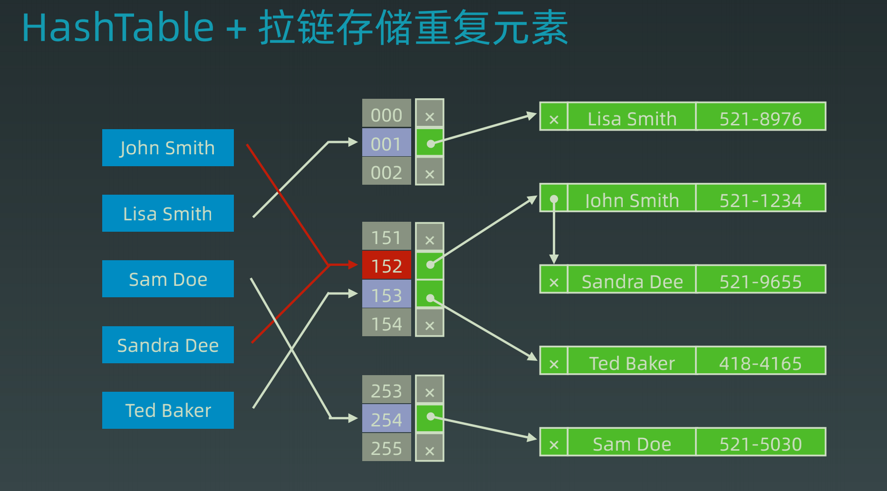
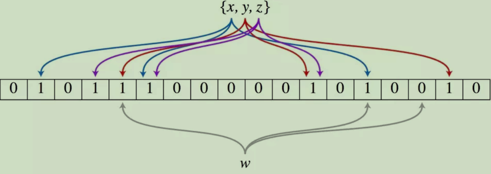
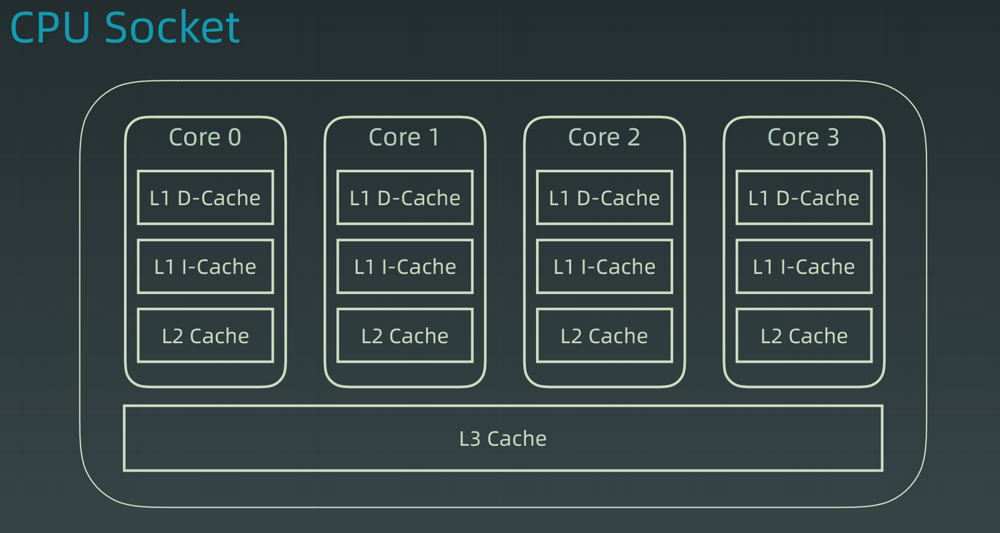
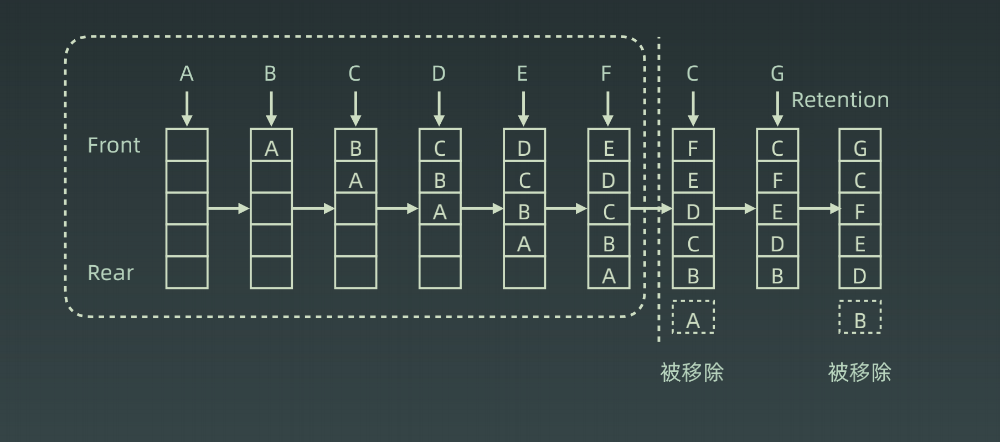

### 位运算

#### Why

​	**机器里的数字表示方式和存储格式就是二进制**

#### 位运算符

|            含义            | 运算符 |     示例     |
| :------------------------: | :----: | :----------: |
|            左移            |  `<<`  | 0011 => 0110 |
|            右移            |  `>>`  | 0110 => 0011 |
|           按位或           |  `|`   |              |
|           按位与           |  `&`   |              |
|          按位取反          |  `~`   |              |
| 按位异或(相同为0、不同为1) |  `^`   |              |

##### XOR 异或

> 常见操作
>
> x ^ 0 = x
>
> x ^ (~0) = ~x
>
> x ^ (~x) = (~0)
>
> x ^ x = 0
>
> c = a ^ b -> a ^ c = b, b ^ c = a // 交换两个数
>
> a ^ b ^ c = a ^ (b ^ c) = (a ^ b) ^ c 

#### 指定位置位运算

> 1. 将x从右边开始算的n位清零	x & (~0 << n)
> 2. 获取x第n位的值(0或者1)	(x >> n) & 1
> 3. 获取x的第n位的幂值	x & (1 << n)
> 4. 仅将第n位 置为1	x | (1 << n)
> 5. 仅将第n位 置为0	x & (~(1 << n))
> 6. 将x最高位至第n位(含)清零	x & ((1 << n) - 1)

#### 实战位运算

> 判断奇偶	x & 1
>
> ÷2	x >> 1
>
> x = x & x - 1	清零最低位的1
>
> x = x & -x 	得到最低位的1
>
> x & ~x = 0

### 布隆过滤器



#### 特点

​	**一个很长的二进制向量和一系列随机映射函数。布隆过滤器可以用于检索一个元素是否在一个集合中。** 

#### 优势和缺点

​	**优点是空间效率和查询时间都远远超过一般的算法**

​	**缺点是有一定的误识别率和删除困难。**



#### 应用

	1. Redis缓存击穿
 	2. 垃圾邮件、评论的过滤
 	3. 分布式系统
 	4. 新闻推荐

### LRU Cache

​	**Least Recently Used**



​	LRU是Cache(缓存)的一种替换算法 - **最近最少使用**

#### 运行示例



#### 实现

**LRU Cache实现是使用Hashtable + DoubleLinkedList**

##### 自己实现双链表

```java
class LRUCache {
    class DLinkedNode {
        int key;
        int value;
        DLinkedNode prev;
        DLinkedNode next;
        public  DLinkedNode () {}
        public  DLinkedNode (int key, int value) {
            this.key = key;
            this.value = value;
        }
    }
    private Map<Integer, DLinkedNode> cache = new HashMap<>();
    private int size, capacity;
    private DLinkedNode head, tail;
    public LRUCache(int capacity) {
        this.capacity = capacity;
        this.head = new DLinkedNode();
        this.tail = new DLinkedNode();
        this.head.next = tail;
        this.tail.prev = head;
    }

    public int get(int key) {
        DLinkedNode node = cache.get(key);
        if (node == null) {
            return -1;
        } else {
            // 将节点更新到双链表头部
            moveToHead(node);
            // 返回value值
            return node.value;
        }
    }

    public void put(int key, int value) {
        DLinkedNode node = cache.get(key);
        if (node == null) {
            // 如果为空 直接添加
            // 添加之后判断是否超出空间大小
            // 如果超出空间大小 删除最尾部节点
            node = new DLinkedNode(key, value);
            addToHead(node);
            cache.put(key, node);
            size ++;
            if (size > capacity) {
                DLinkedNode last = removeTail();
                cache.remove(last.key);
                size --;
            }
        } else {
            // 如果不为空 则更新node.value
            // 将对应节点更新到链表头部
            node.value = value;
            moveToHead(node);
        }
    }

    private void moveToHead(DLinkedNode node) {
        // 将节点刷新到链表头部
        // 删除对应节点
        // 在头部添加
        removeNode(node);
        addToHead(node);
    }

    private void addToHead(DLinkedNode node) {
        // 将节点添加到链表头部
        node.prev = head;
        node.next = head.next;
        head.next.prev = node;
        head.next = node;
    }

    private void removeNode(DLinkedNode node) {
        // 删除当前节点
        node.prev.next = node.next;
        node.next.prev = node.prev;
    }

    private DLinkedNode removeTail() {
        // 删除最近最少使用节点(链表尾部节点)
        // 得到tail的前一个节点
        // 进行删除
        // 返回 方便在哈希表中进行删除
        DLinkedNode prev = tail.prev;
        removeNode(prev);
        return prev;
    }
} 
```

##### 借助Java系统结构

```java
class LRUCache extends LinkedHashMap<Integer, Integer> {
    private int capacity;
    public LRUCache(int capacity) {
        // 第三个参数 accessOrder提供查询的时候 是否开启排序模式
        super(capacity, 0.75F, true);
        this.capacity = capacity;
    }

    public int get(int key) {
        // 这里在进行get的时候 会调用一个 afterNodeAccess() 函数
        // 也就是说 如果开启了排序模式 每次使用get的时候 会将当前访问的节点 重新进行排序
        // 放到双向链表的头部
        return super.getOrDefault(key, -1);
    }

    public void put(int key, int value) {
        super.put(key, value);
    }

    @Override
    protected boolean removeEldestEntry(Map.Entry<Integer, Integer> eldest) {
        return size() > this.capacity;
    }
}
```

### 排序

#### 分类


- **比较类排序**：通过比较来决定元素间的相对次序，由于其时间复杂度不能突破O(nlogn)，因此也称为非线性时间比较类排序。
- **非比较类排序**：不通过比较来决定元素间的相对次序，它可以突破基于比较排序的时间下界，以线性时间运行，因此也称为线性时间非比较类排序。 

#### 复杂度和稳定性


- **稳定**：如果a原本在b前面，而a=b，排序之后a仍然在b的前面。
- **不稳定**：如果a原本在b的前面，而a=b，排序之后 a 可能会出现在 b 的后面。
- **时间复杂度**：对排序数据的总的操作次数。反映当n变化时，操作次数呈现什么规律。
- **空间复杂度：**是指算法在计算机

#### Java实现

```java
	/**
     * 冒泡排序
     * @param nums 需排序数组
     */
    public static void bubbleSort(int[] nums) {
        int n = nums.length;
        for (int i = 0; i < n - 1; i++) {
            boolean flag = true;
            for (int j = 0; j < n - 1 - i; j++) {
                if (nums[j] > nums[j + 1]) {
                    swap(nums, j, j + 1);
                    flag = false;
                }
            }
            if (flag) break;
        }
    }

    /**
     * 选择排序
     * @param nums 需排序数组
     */
    public static void selectionSort(int[] nums) {
        int n = nums.length;
        for (int i = 0; i < n - 1; i++) {
            int min = i;
            for (int j = i + 1; j < n; j++) {
                if (nums[min] > nums[j]) {
                    min = j;
                }
            }
            swap(nums, i, min);
        }
    }

    /**
     * 插入排序
     * @param nums 需排序数组
     */
    public static void insertionSort(int[] nums) {
        int n = nums.length;
        for (int i = 1; i < n; i++) {
            int cur = nums[i];
            int preIndex = i - 1;
            while (preIndex >= 0 && cur < nums[preIndex]) {
                nums[preIndex + 1] = nums[preIndex];
                preIndex --;
            }
            nums[preIndex + 1] = cur;
        }
    }

    /**
     * 快速排序
     * 任意从数组中选出一个数 切成两部分 左子数组比这个数小 右子数组比这个数大
     * @param nums 需排序数组
     */
    public static void quickSort(int[] nums, int begin, int end) {
        if (end <= begin) return;
        int pivot = partition(nums, begin, end);
        quickSort(nums, begin, pivot - 1);
        quickSort(nums, pivot + 1, end);
    }

    private static int partition(int[] nums, int begin, int end) {
        int pivot = end;
        int counter = begin;
        for (int i = begin; i < end; i++) {
            if (nums[i] < nums[pivot]) {
                swap(nums, i, counter);
                counter ++;
            }
        }
        swap(nums, counter, pivot);
        return counter;
    }

    /**
     * 归并排序
     * 从中间开始切割为两个数组 左右子数组各自排序 最后进行合并
     * @param nums 需排序数组
     */
    public static void mergeSort(int[] nums, int left, int right) {
        if (right <= left) return;
        int mid = (left + right) >> 1;

        mergeSort(nums, left, mid);
        mergeSort(nums, mid + 1, right);
        merge(nums, left, mid, right);
    }

    private static void merge(int[] nums, int left, int mid, int right) {
        int[] temp = new int[right - left + 1];
        int i = left, j = mid + 1, k = 0;
        while (i <= mid && j <= right) {
            temp[k++] = nums[i] > nums[j] ? nums[j++] : nums[i++];
        }
        while (i <= mid) temp[k++] = nums[i++];
        while (j <= right) temp[k++] = nums[j++];

        for (int z = 0; z < temp.length; z++) {
            nums[left + z] = temp[z];
        }
        // // System.arraycopy(temp, 0, nums, left, temp.length);
    }

    /**
     * 堆排序 - 调用系统的结构(优先队列)
     * @param nums 需排序的数组
     */
    public static void heapSortSystemStruct(int[] nums) {
        int n = nums.length;
        Queue<Integer> queue = new PriorityQueue<>();
        for (int i = 0; i < n; i++) {
            queue.offer(nums[i]);
        }
        for (int i = 0; i < n; i++) {
            nums[i] = queue.poll();
        }
    }

    /**
     * 交换数组元素
     * @param nums 数组
     * @param i 第一个元素下标
     * @param j 第二个元素下标
     */
    private static void swap(int[] nums, int i, int j) {
        int temp = nums[i] ^ nums[j];
        nums[i] = nums[i] ^ temp;
        nums[j] = nums[j] ^ temp;
    }	
```

#### 高级排序 O(N*logN)

归并 和 快排 具有相似性，但步骤顺序相反
归并：先排序左右子数组，然后合并两个有序子数组
快排：先调配出左右子数组，然后对于左右子数组进行排序

堆排序（Heap Sort） — 堆插入 O(logN)，取最大/小值 O(1)

1. 数组元素依次建立小顶堆

2. 依次取堆顶元素，并删除

#### 特殊排序 O(N)

##### 计数排序（Counting Sort）

计数排序要求输入的数据必须是有确定范围的整数。将输入的数据值转化为键存储在额外开辟的数组空间中；然后依次把计数大于 1 的填充回原数组.

##### 桶排序（Bucket Sort）

桶排序 (Bucket sort)的工作的原理：假设输入数据服从均匀分布，将数据分到有限数量的桶里，每个桶再分别排序（有可能再使用别的排序算法或是以递归方式继续使用桶排序进行排）。

##### 基数排序（Radix Sort）

基数排序是按照低位先排序，然后收集；再按照高位排序，然后再收集；依次类推，直到最高位。有时候有些属性是有优先级顺序的，先按低优先级排序，再按高优先级排序。